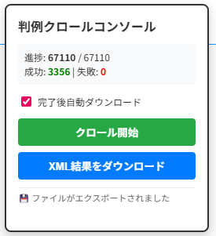

# LegalDoc 判例クロールツール（ダウンロード制御強化版）

## 概要

これは[Tampermonkey]([https://github.com/lijunjie2232/legaldoc-spider](https://www.tampermonkey.net)) or [violentmonkey](https://violentmonkey.github.io) 用のユーザースクリプトで、日本語の法律ドキュメントサイト `legaldoc.jp` から判例情報を自動的に収集するためのツールです。

## 機能

- **自動クロール**: `legaldoc.jp/hanrei/hanrei-search` ページから判例データを自動収集
- **プログレス管理**: 現在の進捗状況をリアルタイム表示
- **XMLエクスポート**: 収集したデータをXML形式でダウンロード
- **中断・再開機能**: 処理中に中断しても続きから再開可能
- **失敗リトライ**: 失敗したリクエストを自動的に再試行
- **カスタム総量設定**: 手動でクロールするデータの総数を指定可能

## 主な特徴

- **Ajaxリクエスト処理**: Jakarta Facesのページング機能に対応
- **ViewState管理**: フォーム状態を維持しながら連続クロール
- **進捗表示**: 成功/失敗件数をリアルタイム表示
- **自動ダウンロードオプション**: クロール完了後にXMLを自動保存
- **ローカルストレージ**: 設定や進捗をブラウザに保存

## 使い方

1. Tampermonkey拡張機能をブラウザにインストール
2. このurl[https://raw.githubusercontent.com/lijunjie2232/legaldoc-spider/refs/heads/master/violentmonkey_script.js](https://raw.githubusercontent.com/lijunjie2232/legaldoc-spider/refs/heads/master/violentmonkey_script.js)をTampermonkeyに追加
3. `https://legaldoc.jp/hanrei/hanrei-search` にアクセス
4. 右上に表示される操作パネルを使用してクロールを開始

## 注意事項

- 合法的な範囲での利用のみ可
- サイトの利用規約を確認すること
- 過剰なリクエスト負荷を避けるため適切な間隔を設けている
